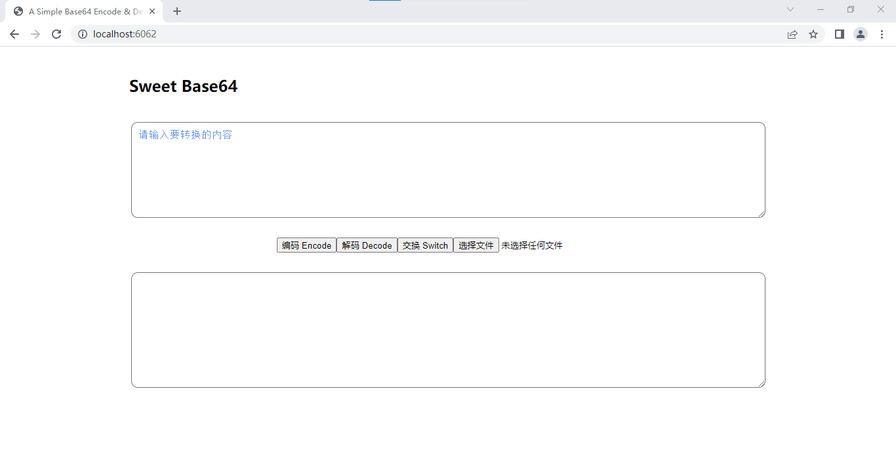

## Sweet Base64

#### 1. 一个简单的Base64编码解码工具

**A Simple Base64 Encode & Decode Tool**

#### 2.易用 轻量 快速部署

**Easy  &  Lightweight  &  FastToDeploy**

#### 3.已通过开源安全社区OSCS的安全认证

#### 4.用户界面

备注：

> 1. 前端页面使用了vue和axios的cdn资源，因此使用体验可能会受限于实际的网速
> 2. 不建议上传较大的文件进行编码
> 3. 本项目源码不涉及对文本和文件的存储
> 3. 部署时仅需在项目根目录下执行 ./Windows_ver.exe 或 ./Linux_ver

#### 5.部署

在项目根目录下，生成可执行文件

> windows

~~~
go env -w GOOS=windows
go build -o Windows_ver.exe .
~~~

> linux

~~~
go env -w GOOS=linux
go build -o Linux_ver .
~~~

